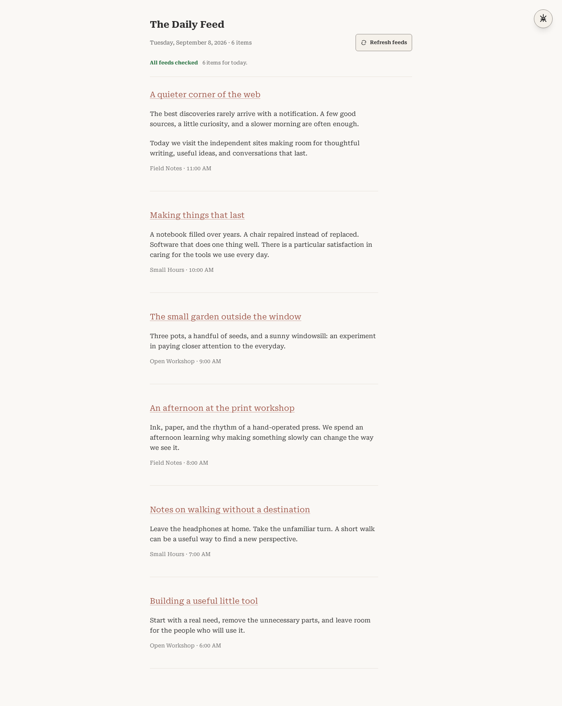

<p align="center">
  
</p>

<h1 align="center">The Daily Feed</h1>

<p align="center">Today's articles. Your sources. A quieter way to read.</p>

<p align="center">
  <a href="https://github.com/astrazds/thedailyfeed/actions/workflows/ci.yml"></a>
  <a href="LICENSE"></a>
</p>

The Daily Feed is a self-hosted RSS reader for the articles published today.
Choose your feeds, open the page, and read a clean, chronological stream.
There are no accounts, unread counts, or subscriptions to a service.

<p align="center">
  
</p>

The screenshot shows the actual application with synthetic content.
[Mobile screenshot](docs/assets/reader-narrow.png)

Current release: `1.2.1`.

## Install and self-host

You need Git, Docker with Compose v2 and Buildx, and a host-installed reverse
proxy for public access. Containers are built from source; no registry account
or prebuilt application image is required.

```bash
git clone https://github.com/astrazds/thedailyfeed.git
cd thedailyfeed
cp env.template .env.production
chmod 600 .env.production
./scripts/deploy-compose.sh
```

Open `http://127.0.0.1:3000` on that host. Compose binds only to loopback,
uses its own network, and runs a non-root container with a read-only filesystem.
Set `APP_PORT` in `.env.production` if port 3000 is already in use.

For internet access, follow [DEPLOYMENT.md](DEPLOYMENT.md), including the
[complete Nginx HTTPS example](deploy/nginx.conf). Public TLS, rate limits,
request-body limits, and unbuffered streaming belong at the reverse proxy.

## Use

- Open **Manage feeds** to add, edit, disable, or delete a source. Additions
  validate the RSS or Atom URL before saving. The inventory limit is 50 feeds,
  including disabled feeds; older oversized inventories are never trimmed.
- Import or export an OPML file to move subscriptions between browsers.
  Import skips duplicates and invalid URLs, and reports entries over the limit.
- Read today's items in your browser's timezone, newest first. Articles appear
  progressively as each source finishes. Expand long excerpts or open the original.
- Choose the **Refresh feeds** icon to check your sources again. A thin header
  progress line and feed count track loading while available articles stay
  readable. Open **Manage feeds** to see which sources are still checking or
  need another try.
- If sources fail or remain unchecked, use **Refresh feeds** or **Try again**
  in the reader, or **Try all feeds again** in the manager. A checked source may
  have failed or timed out; **Not checked** means no result arrived for it.
- Install the app through your browser if it supports PWAs. Saved same-day
  snapshots provide fallback for the same enabled sources and timezone.
  **Unable to refresh** identifies saved content after a request failure.

See the synthetic [feed-manager progress](docs/assets/loading-manager-narrow.png)
screenshot.

## Privacy

Subscriptions and same-day offline snapshots stay in this browser's
`localStorage`. OPML processing is client-side. Feed URLs are sent to the app
server for fetching and validation; the server keeps a bounded in-memory cache.
Publisher images load directly in the browser and can reveal your IP address
to their hosts. Typography is bundled locally. There is no application analytics
or account database. Read [PRIVACY.md](PRIVACY.md) for the full data flow.

## Limitations

This is a reader for today, not an archive or a cross-device reading service.
There is no account, sync, full-text extraction service, or guaranteed offline
copy of every article or image. Clearing site data removes your subscriptions
and snapshots; export OPML before moving or resetting a browser. Feed quality,
publication dates, upstream availability, and publisher content determine what
appears. Private-network feeds are blocked in production by default.

Refresh requests can reuse the server's feed cache, which lasts one hour by
default. The current app also checks feeds hourly while the page remains open.
The [vision](VISION.md) calls for reader-initiated retrieval; the
[implementation gaps](docs/architecture-decisions.md#known-implementation-gaps)
record this difference.

## Development

Use [mise](https://mise.jdx.dev/) to select the Node, pnpm, and Python versions
in `mise.toml`. Python runs the independent XML tests.

```bash
mise install
mise run install
mise run dev
```

For focused checks, use `mise run test`, `mise run lint`, or `mise run typecheck`.
The full portable gate also needs Docker/Buildx and Chromium system dependencies:

```bash
mise run verify
```

It installs locked dependencies, validates release metadata, runs lint,
TypeScript and unit tests, builds Next/PWA output, runs isolated Playwright
smoke tests, and builds one unpublished Docker image. It never deploys.

After `mise run build` and `mise run browser-install`, run `mise run browser`.
Use `mise run integration` for the API tests that start a local server.
See [browser verification and screenshots](CONTRIBUTING.md#browser-verification-and-screenshots)
for capture commands, evidence, and coverage limits.

See [CONTRIBUTING.md](CONTRIBUTING.md), [SECURITY.md](SECURITY.md), and
[TECHNICAL.md](TECHNICAL.md) for contribution guidance, private security reporting,
and the public JSON/NDJSON contracts. Self-hosting and updates are covered in
[DEPLOYMENT.md](DEPLOYMENT.md). Application code is [MIT licensed](LICENSE);
Roboto Serif retains its [SIL Open Font License](public/fonts/OFL.txt).
